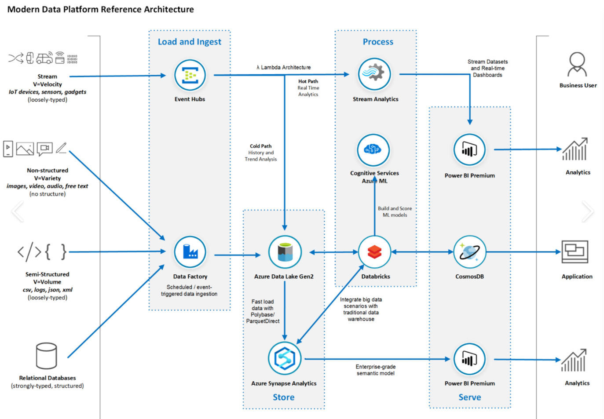

## Are they storing their data in the right place?

The cloud has brought in a new era of **polyglot persistence**, enabling complex applications to utilise a host of different storage services for different parts of the system, so no longer do architects and developers need to compromise their choices. If they're only using one storage technology then this should perhaps be a warning flag that either they've got very simple needs or they're trying to do unnatural things with the data and stick with a single storage type, perhaps based on limited internal skills or experience - it is not uncommon to see developers storing non-relational data in SQL just because they're familiar with it, and that could not only be a potentially costly experience but is not a great developer experience. 

This question is designed to start an open dialogue about the different sorts of data the system needs to handle and where it should be stored. 

At a high level:

* Line of business transaction data – SQL Server or one of the open-source SQL engines 
* Azure Data Lake – ingestion, immutability and data governance considerations
* Polyglot architecture – NOSQL, relational data store, big data
* Consider the following
    * Volume (Amount of Data)
    * Velocity (Speed of Data)
    * Variety (Structured / Semi structured)
    * Variability (Inconsistencies in the data)
    * Veracity (Confidence or trust in the data)
    * Validity (How accurate and correct the data is for its intended use)
    * Vulnerability (How secure/sensitive the data is)
    * Volatility (Age to irrelevance)
    * Visualization (How easy it is to visualize)
    * Value (How much value does it give the business)

This article provides a good overview of each data store model, so be sure you fully understand each store and are able to discuss its applicability and relevance, looking at this [data store overview](https://docs.microsoft.com/en-us/azure/architecture/guide/technology-choices/data-store-overview)

For example, the recent release of **Azure Synapse Analytics** allows large volumes of data to be stored at very low prices in Azure Data Lake and but to run SQL queries over that data, giving systems the best of both worlds (low cost and easy access). This can change not only the way partners approach data storage, but also the underlying cost model, and in the bigger picture provides the ability to have new and innovative pipelines that take data through the various stages with each service being optimised to perform a specific set of tasks.

**This multi-tier model is a good system design**. Different tiers serve different purposes and each builds on the previous. The idea is to land the raw data in one part of the system and keep hold of it, in case it needs to be revisited at future date. This can then be processed into a format better suited for the internal elements of a system. Finally, the data may need to be visualised and formatted for user interactions and queries. It's worth pulling this out as a pattern because often there's a temptation to skip the three stages and merge them together into just one or two, a decision which can come back and bite at a future date. For example imagine a customer collecting lots of raw telemetry data and then the idea comes to build a machine learning model, so they need to access potentially years worth of raw data to help build a new model - If we don't separate out and retain the data there's a strong chance it wont be available for processing and model building.

On the face of it technologies such as **Databricks** ([Azure Databricks documentation](https://docs.microsoft.com/en-us/azure/databricks/)) and **Azure Synapse** ([Azure Synapse Analytics](https://azure.microsoft.com/en-us/services/synapse-analytics/)) look like they perform similar functions that can lead a partner to either get confused or choose an option that is not the best fit, so make sure you have a good high level model in your mind of these technologies and understand what they and where they apply.

Questions need to be asked to understand the partners skills sets, key business drivers and data requirements to properly ascertain the correct tools for their architecture as a lot of the subtleties will be lost to them at the early stage of an architecture.

Another thing to consider when thinking about data storage is any requirement to **share this data with their customers**. Using tools like Power BI make it easy to visualise data and with the use of Power BI embedded this can be surfaced inside an application. However, there are times when customers want direct access to their data, either to ingest into their own Data Warehouse or to use their own reporting tools outside of the partner’s application. Whilst there can be a lot of options here, generally this can be solved with one of the following:

1. Build an API – this has the benefit of being generic in how data is accessed, but has a trade-off of long development times or performance if used for reporting
1. Grant access to underlying data store – this requires no additional development, but can have security challenges or not be possible in a non-public database implementation
1. [Azure Data Share](https://docs.microsoft.com/en-us/azure/data-share/overview) – this offers the ability to have incremental or full snapshots of data, from a number of data sources to a number of different target technologies.
1. [Azure Synapse Analytics (Data Exfiltration)](https://docs.microsoft.com/en-us/azure/synapse-analytics/security/workspace-data-exfiltration-protection) – this allows a controlled sharing with a specific Active Directory tenant
1. Azure Data Factory – data can be pushed to a store for the customer, this could be a database, FTP, or any available sink
