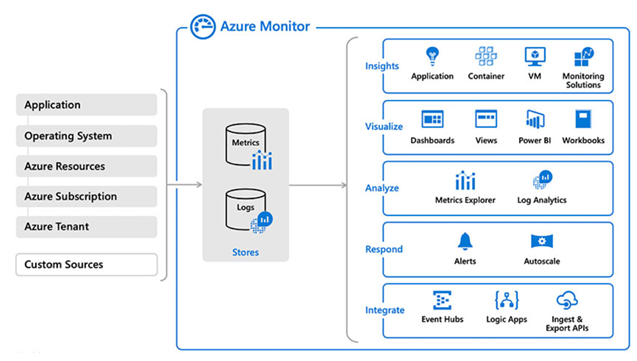
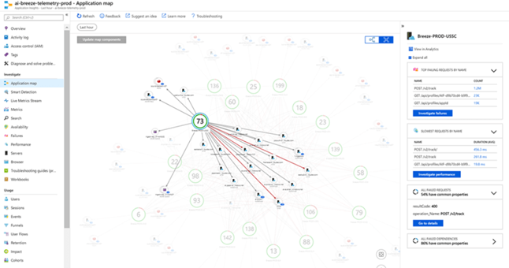
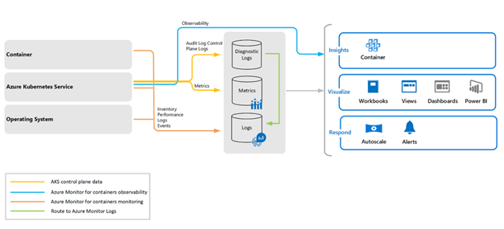
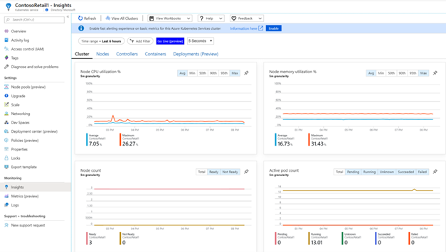

## What monitoring do they have in place?

In a nutshell, they should be able to spot an issue before a customer does! If you walk into a partners operations area and see lots of big displays on the walls with monitoring and analytics information from their live running system then they're probably in quite a good state, but this can be quite rare. Moreover, not only is monitoring an important aspect of design in its own right, it's also a good indicator of how well organised and how on top of the technology the partner is. If they have a good monitoring strategy in place, it's a good sign. 

Microsoft has had a number of different monitoring solutions, many developed on a per product basis, but recently these have all coalesced around one single brand, that of **Azure Monitor**. So, for most scenarios, **Azure Monitor** is the starting point for the discussion. 

**Azure Monitor** covers the complete stack to give a more holistic view of a running system:

* **Monitor applications** - availability, performance, usage of your web applications, etc
* **Monitor infrastructure** - analyse and optimize the performance of virtual machines, Azure Kubernetes Service, Azure Storage, and databases
* **Monitor network** - monitor and diagnose networking issues without logging into your virtual machines, diagnose routing issues, analyse network security group flow logs, etc

Many application developers in the Microsoft ecosystem will already probably be aware of **Application Insights**, which is part of Azure Monitor, and will have used it to help debug applications. These days it does much more than just debugging - **Azure Monitor for containers**, for example, is designed to monitor the performance of container workloads deployed in AKS, ACI, etc.

It provides performance charts that show key performance metrics of a cluster, to give much clearer and more meaningful insights into the overall performance.

[Source](https://docs.microsoft.com/azure/azure-monitor/insights/container-insights-overview)

When the question comes up around what exactly should be measured, a sensible set of defaults is usually provided, however you can’t go wrong by recommending the **Four Golden Signals (latency, traffic, errors and saturation)** as a baseline. These will give a good indication of the end-user customer experience and any degradation.

The [Site Reliability Engineering learning path](https://docs.microsoft.com/learn/modules/intro-to-site-reliability-engineering/) is a great place to start to read more.

To find more detailed information on the Four Golden Signals, originally popularised in the SRE book from Google, visit [https://laredoute.io/blog/how-the-4-golden-signals-support-your-business-observability/]

Instrumentation is also key to **managing cost**, so **always ask if they have they costed their system**? This might seem a slightly unusual question to ask, but in many cases designers haven't done a full cost analysis to work out how much a system will cost to run either on a per user or per customer basis, and this work is essential to ensure that their pricing gives them the sufficient margins to run the system successfully. Sometimes the costing exercise can be relatively simple but often it's harder because users have a different mix of scenarios that they work through and so it tends to require they think about different journeys different types of operations and the mix of work that happen and then try to cost from there. If they have an existing on-premise system, there probably in a much better situation and can get historic data to help them make those calculations. But doing costing without data is really, really difficult.

Below is a real world example of a solution that was doing a lot of monitoring during its beta testing and as you can see from the diagram below, the team were able to see the operational characteristics of the solution and discover not only had they over specified the machine, which is fine for a beta to make sure it ran and they could collect, but using the monitoring data but they then were able to change the underlying AKS nodes to get the cost optimised mix of memory and CPU:

